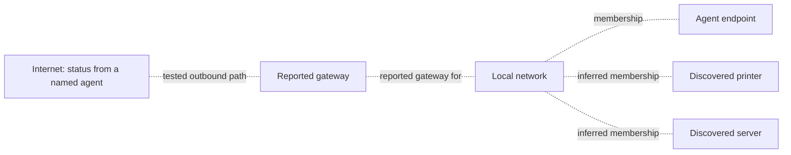
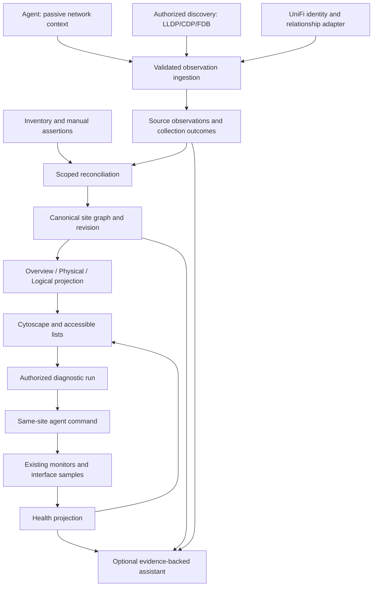

# Intelligent network topology

Date: 2026-09-15
Status: Approved engineering specification; advisor quorum complete; five milestone plans authored and registered; implementation not started (see §10 and §13)
Audience: Breeze technicians investigating connectivity and managers reviewing site health
Source baseline: checkout `a3be84980`

## 1. Scope and reading order

Every known network gets an automatically arranged, useful logical overview. Endpoint route information supplies gateways and network membership without LLDP, SNMP, or controller access. Additional discovery adds switches, APs, ports, and physical relationships. Selecting a device or connection exposes evidence, monitoring, and bounded diagnostics. Optional AI explains those results.

This document owns product behavior, architecture, UI, delivery, and acceptance. The companion documents are normative within their domains:

1. [Data and API contracts](2026-09-15-intelligent-network-topology-data-contracts.md): identity, storage, isolation, graph/read/write contracts, compatibility.
2. [Collection and reconciliation](2026-09-15-intelligent-network-topology-collection.md): agent payloads, platform collection, evidence lifecycle, synthesis.
3. [Operations and AI](2026-09-15-intelligent-network-topology-operations.md): health, checks, telemetry, incidents, AI, budgets.

Endpoint names and enum spellings come from Data and API contracts; collection payload fields from Collection; diagnostic limits and health rules from Operations. Delivery prerequisites and user-visible promises come from this document. Resolve conflicts in this order of ownership rather than treating the earlier [feasibility proposal](2026-09-15-intelligent-network-topology-proposal.md) as another contract.

This supersedes the [June topology redesign spec](2026-06-22-network-topology-redesign-design.md) and its [four phase plans and index](../../plans/monitoring/2026-06-22-1728-topology-redesign-INDEX.md), now marked historical and non-dispatchable. Existing manual mappings, saved layouts, permissions, and inventory remain migration inputs. It does not modify old migrations or reinterpret old speculative links as facts.

## 2. Product commitments

| ID | Requirement |
| --- | --- |
| T01 | A site with devices or configured networks renders a logical map with no management protocols enabled. |
| T02 | Configured/observed networks, unknown gateway placeholders, and internet status are useful even with no online collector. Missing evidence remains visible. |
| T03 | `network_member`, `default_route`, `egress_path`, `attachment`, `physical_link`, and presentation-only schematic relationships are distinguishable. |
| T04 | Observed routes come from the reporting endpoint/interface. A subnet, `.1` address, device label, or LLM guess cannot establish a physical link. |
| T05 | Initial layout runs automatically; refresh preserves positions, selection, and viewport; pins survive discovery changes. |
| T06 | New physical evidence improves the overview without duplicating assets or deleting manual assertions. |
| T07 | Each relationship exposes evidence source, reporting device, timestamp, confidence, and freshness. Health is a separate property. |
| T08 | Devices, gateways, connections, and internet targets expose applicable checks and history with the origin of each measurement. |
| T09 | Missing/failed collection, an offline agent, or a blocked ping cannot silently become a confirmed site outage. |
| T10 | Reads are passive. Opening or refreshing a map never starts scans, external probes, LLM calls, or recurring monitors. |
| T11 | All graph, evidence, metrics, diagnostics, cache, and AI access enforce organization RLS and application-layer site authorization. There is no database site-access policy; same-scope FKs prevent malformed associations, not unauthorized same-org reads. |
| T12 | Existing agents and legacy maps continue working during staged rollout; new evidence is optional and versioned. |
| T13 | Large sites use summaries, bounded expansion, and searchable lists, with visible counts instead of silent truncation. |
| T14 | Keyboard users can select every node/link, inspect evidence, and run authorized actions through an equivalent list view. |
| T15 | AI findings cite scoped observations/results and distinguish known facts, hypotheses, and missing evidence. |

Success is a technician opening an unfamiliar site, seeing its known networks and outbound paths without arranging anything, selecting a problem area, and obtaining evidence or a clear next check. A fully discovered physical diagram is an enrichment, not the entry requirement.

## 3. Fixed decisions and boundaries

- Retain Astro/React, Cytoscape canvas, Postgres/Drizzle, BullMQ, and the existing agent command transport. No graph database or external topology SaaS is required.
- Introduce an additive canonical graph API under `/topology/sites/:siteId`. Keep `/discovery/topology` and legacy writes available during migration.
- Network Overview is the default. Physical and Logical views are alternate projections of the same evidence; Health is an overlay. A physical view can be empty while Overview remains useful.
- Use endpoint operating-system routes, interfaces, and configured DNS for the baseline. Management protocols are optional. An absent default route is a valid outcome.
- New relationships require evidence or an explicit manual assertion. A placeholder is a presentation label, not a canonical node/relationship enum: use `presentation:` IDs and `meaning:'schematic'`. Dotted schematic connectors exist only in the presentation response and cannot enter pathfinding, incident impact, or LLM evidence as observed connectivity.
- Internet is a diagnostic destination concept. Report reachability from named origins; do not claim a single site-wide WAN, ISP, circuit capacity, or physical WAN port without supporting configuration/evidence.
- LLM use is optional and off the render/collection path. Topology, layout, health computation, and checks work without an AI provider.
- Network/discovered inventory lives in `discovered_assets`; `typeSource = 'manual'` makes its type override sticky. Topology classifies a node's role separately from inventory's manually selected type.
- This project does not configure routers, change VLANs/routes/firewall rules, restart ports, reset PoE, or remediate endpoints automatically. Those are separate future actions with their own authorization.
- Cross-site physical stitching, complete Internet hop maps, NetFlow/sFlow ingestion, rack/cable documentation, and historical graph replay are deferred. Retained evidence/change events support investigation; a full replay UI is not implied.

## 4. Baseline network experience

Illustrative topology only; all edges below describe logical relationships:



The network node represents a network segment or provisional grouping, not an invented switch. Show its prefix and how the grouping was determined. One unmanaged switch, several hidden switches, or a wireless bridge can all remain behind that logical group without invented hardware.

| Available information | Required overview |
| --- | --- |
| Agent with interface/prefix and default route | Endpoint/network, observed gateway role, internet target, route evidence; internet remains unknown until a relevant check exists. |
| Discovery inventory and profile, no route-capable agent | Devices grouped by profile/network evidence; gateway placeholder labeled “Not identified”; internet “Not tested.” |
| Devices without a trustworthy prefix | “Network not identified” group with member devices; dotted schematic gateway/internet placeholders; no physical/routed assertions. |
| Configured profile, zero devices | Configured network group and zero-device state; collection guidance remains visible. |
| Site with no profiles and no devices | One compact setup state: add an agent, discovery profile, or manual network. Do not invent a populated network. |
| Isolated segment / no default route | Local membership graph and “No default route reported”; Internet target may remain as a test destination but has no observed outbound edge. |
| Multiple gateways or different endpoint routes | Separate gateway roles and reporting-device associations. Do not choose one gateway for all peers by majority vote. |
| VPN, policy routing, or multiple active interfaces | Separate route contexts with origin/interface labels; unsupported policy details marked incomplete. |
| IPv6 link-local gateway | Gateway identity includes interface/zone context; never merge by address alone. |
| Agent offline | Last known topology with stale badges, last successful collection, and no fresh internet-health assertion. |
| Rich physical discovery arrives | Add known infrastructure, fold redundant diagram lines, preserve logical facts and positions, expose the physical view. |

The Overview can draw a network-to-gateway projection for readability, but selection states “Reported by these devices” and identifies conflicting/unreported members. The underlying default-route relationship remains endpoint/interface-to-gateway. Internet-path evidence similarly retains its probe origin and route selection.

Gateway placeholders are distinct from observed virtual gateway roles. A placeholder has no address or health unless supplied explicitly. An observed gateway can be a virtual IP/service rather than one physical chassis. Binding discovered hardware to that role requires evidence; simultaneous HA members are not merged into one device.

## 5. Architecture



Each site is a reconciliation/authorization boundary. An authenticated collector writes observations under its server-resolved org/site; it cannot select another tenant in a payload. Changed source content is persisted and marks the site dirty, coalescing a BullMQ reconcile job. Digest-confirmed unchanged collections renew compact freshness without appending run/observation rows or rebuilding an unchanged graph; Collection defines the bounded exception for a qualifying second complete miss. The database `build_fence` prevents an older worker from publishing over newer evidence. Publication of changed nodes/relationships and graph revision is atomic.

Collectors publish observations; the graph builder owns derived relationships; the health projector owns current health; layout owns coordinates. Inventory remains authoritative for device identity and manually selected labels/types. AI has no direct graph writer.

Coalesce bursts for up to two seconds per site; ensure another job is scheduled when ingestion occurs during a build. Redis outage does not drop accepted data: retain a dirty revision and use a periodic repair scheduler after recovery. Retried processing is idempotent. Reconciliation errors preserve the last valid graph and set a visible “Update delayed” state.

## 6. Interface and navigation

### Entry points

- Discovery's existing Topology tab opens Overview for the current site; if no site is selected, use the sole authorized site or show a site chooser. Do not mix same-address networks across all sites on one canvas.
- Add Topology to both network-device detail and managed-device detail where an authorized site exists. Resolve inventory binding, focus that node and one-hop context, and offer “Show full site.” Do not create an asset just to show its agent endpoint.
- Device-less network and Internet targets open an inspector rather than a broken device-details URL.
- Use hash state: `#topology/site/<siteId>/view/<overview|physical|logical>/node/<nodeId>` or `/edge/<relationshipId>`. Add new `#topology` handling to managed-device and network-device detail routes, including their tab unions/registries; neither has an implemented Topology tab in this checkout. The new handler derives the site from the device. Optional `search/<encodedText>` and `group/<nodeId>` segments preserve navigation. Reject malformed/unauthorized IDs safely.
- Adopt hashes after hydration via the existing `useHashState` pattern. Back/forward changes selection/view. API query parameters are allowed for server requests; browser transient state remains in the hash.

### Composition

Operate mode within Breeze's existing web design system. Preserve the established shell, tokens, typography, light/dark themes, and component patterns. Root `DESIGN.md` currently describes Mobile; it does not override web components. No new brand world or app-wide token changes are part of this feature.

Illustrative desktop structure:

```text
Topology   [Site] [Search devices or addresses] [Overview ▾] [Health]
Observed 2m ago · Network detail: limited       [Fit] [Arrange ▾] [Edit]
┌───────────────────────────────────────────────┬─────────────────────┐
│                                               │ Selected connection │
│    Internet — gateway — network — devices     │ Relationship / age  │
│                                               │ Evidence / health   │
│    Expand a group to reveal its endpoints     │ Checks / history    │
│                                               │ [Run diagnostics]   │
├───────────────────────────────────────────────┴─────────────────────┤
│ Legend: physical · logical · inferred · placeholder | Device/link list│
└─────────────────────────────────────────────────────────────────────┘
```

The example text/time is synthetic. Real status and counts always come from the current response.

- Canvas receives the main content area. A docked inspector opens without changing node coordinates; resize preserves the selected element's screen position where possible. At narrow widths it becomes a bottom sheet, with a full-page list alternative.
- Compact device tiles show role icon, name, and a status badge. At medium zoom show names; at wide zoom show infrastructure and group counts; on focus show addresses, ports, and evidence. Avoid labels overlapping adjacent cards.
- Neutral normal connections, solid physical lines, dashed logical lines, and dotted inferred/schematic lines. Add text labels/legend and distinguish schematic edges with an explicit “Not identified” label. Red/amber describe health only; provenance does not borrow green/red health semantics.
- Network/group cards show name/prefix, device count, issue count, and evidence quality. Collapsed groups show affected-member counts, not an unsupported single health judgment.
- Search covers name, IP, MAC, and inventory label within the current authorized site. Search results can locate a device inside a collapsed/unloaded group without expanding the whole graph.
- A coverage panel explains missing routes, credentials, unsupported protocols, failing collectors, stale observations, and unresolved attachments. Show setup actions only when permitted. “Limited network detail” is compatible with a useful logical map.

### Interaction behavior

| Action | Behavior |
| --- | --- |
| Select device | Highlight its neighborhood; inspector shows identity, networks/routes, freshness, alerts, checks, and inventory navigation. |
| Select relationship | Show relationship meaning before metrics; both known endpoints/ports, source observations, confidence, timestamps, and applicable tests. |
| Select placeholder | Explain what is unknown; offer authorized discovery/setup/manual identification; never offer port health for nonexistent hardware. |
| Expand/collapse group | Animate only local changes, preserve neighbors and pins, display hidden counts and load status. |
| Run diagnostics | Show selected collector and scope; submit explicit action with pending/progress/terminal result; retained result survives navigation. |
| Refresh | Reload cached/materialized graph and health; it does not rescan. “Rescan” is a separate authorized action. |
| Arrange new devices | Position only nodes lacking a saved layout; save in a batch if editable, or keep local positions for readers. |
| Reflow unpinned | Preview a reflow, Apply or Cancel; pinned nodes stay fixed; one-session Undo uses revision checks. |
| Drag and pin | Editing separates position from pin state; drag persists position and pins it, explicit Unpin keeps coordinates but permits later reflow. |
| Manual connection | Explicit Connect action, choose endpoints and meaning; no incidental connection creation from ordinary selection. Mark assertion clearly. |
| Suppress disputed relationship | Record a scoped view exclusion with reason; preserve observation history. Suppression is not evidence of disconnection and does not suppress alerts. |
| Ask AI | Send the selected scope and evidence snapshot only after user action; stream answer with evidence links and follow-up check proposals. |

Manual edits, diagnostics, rescan, and saves use `runAction`, pending/disabled states, visible results, and the standard auth-error behavior. A successful queue submission is “Queued,” never “Check passed.” Local pan/zoom and reversible view arrangement do not require write permission.

### States and accessibility

Initial loading uses a stable canvas/list skeleton. Failed loading shows Retry and any previously loaded graph with a stale notice. No neighbors means a logical overview; a physical view without measured links offers “View network overview.” Collector unavailability leaves checks disabled with a reason and existing history readable.

Keyboard navigation uses the node/connection list and standard focus order. Search, view controls, inspector close, expansion, and all actions are keyboard accessible. Selection is announced through a polite live region; do not announce every metric tick. A connection list exposes equivalent evidence/actions to canvas edges. Use shape/text plus color, visible focus, reduced-motion support, scalable text, and existing dialog focus-management components. Test light/dark, long translated labels, 200% zoom, and 390px mobile. Localize all product copy; inventory labels remain user data.

## 7. Layout contract

Default layout: ELK Layered in a browser web worker for automatic initial placement and explicit reflow. The web topology layout controller owns scheduling and measurement; there is no server-side first-layout job. Keep Cytoscape as renderer; map returned node positions and edge bend points through a typed adapter. Load the layout dependency only when needed. ELK supports the required ports, compound graphs, and parallel edges; this is documented capability, not a guarantee of arbitrary pin support. [ELK reference](https://eclipse.dev/elk/reference/algorithms/org-eclipse-elk-layered.html).

1. Generate a view graph with stable IDs, consistent sort keys, actual measured card/label sizes, role-based preferred layers, and all relevant edges. Pin the random seed and layout option version.
2. For an unplaced graph with no pins, arrange components in layers: Internet targets, gateways, infrastructure/network segments, endpoint groups. Preserve cycles and redundant edges; orientation is presentation, not traffic direction.
3. For incremental additions, leave saved nodes unchanged. Lay out only new components, including adjacent saved anchors as constraints in the placement wrapper. Place their bounds near the anchor group in a deterministic collision-free candidate search; fixed objects are obstacles.
4. For reflow with pins, partition movable components around fixed nodes, lay out each component, then pack around anchor positions. Do not pretend ELK itself enforces arbitrary absolute pins. Recompute edge routing after placement.
5. Node/card spacing defaults: 32px between bounds, 96px between layers, 48px inside expanded group boundaries. These are starting tokens, validated with actual labels; no overlap tolerance for unpinned cards at 100% zoom.
6. User-pinned collisions are preserved and flagged with a small “Overlapping pinned devices” action; do not silently move pins. The operator can unpin/reflow. If automatic packing exceeds 5,000 candidates or 3 seconds, use a deterministic overflow grid labeled “Arrange remaining devices,” retain pins, and report a recoverable layout warning.
7. Never invoke global fit or reflow on health refresh. Initial Fit frames the focused neighborhood with bounded zoom. Fit is an explicit escape hatch thereafter.
8. After hydration, the first successful graph response with unplaced visible nodes triggers local layout once fonts and card measurements are ready. The main thread measures bounded/truncated card and label sizes and sends numbers to the worker. A changed projection triggers incremental placement only for newly visible unplaced nodes. All readers receive a usable transient layout; only an editor's explicit Apply/Save writes shared positions through revisioned batch writes. Render is not gated on save success. Initial/refresh reads cannot auto-save even for an editor.
9. Store view-specific coordinates, explicit pins, layout algorithm/version, and layout revision. Persist edges' bends as derived cache, not durable physical data. Undo applies only if the shared layout revision has not changed; otherwise offer a new preview rather than overwriting another editor.
10. Keep semantic zoom/group expansion separate from canonical graph membership. A collapsed group is a projection with counts, not a newly discovered device.

The existing fCoSE implementation can remain for the legacy map during migration. A later optional mesh layout must honor the same pin/collision/persistence contract; it is not required to launch this feature.

`elkjs` is a new pinned web dependency and this is the topology feature's first worker integration. Add an Astro/Vite module-worker entry using `new Worker(new URL('./layout.worker.ts', import.meta.url), { type: 'module' })`; import the engine inside that worker, with no CDN or Node worker dependency. Current Astro and middleware CSP already permit `worker-src 'self' blob:`; serve the bundled worker from the same origin and test both header paths without widening CSP. SSR never constructs a Worker. A request ID plus graph/layout/measurement revision fences stale responses; terminate/cancel on site switch, unmount, superseding request, or the three-second budget. Worker construction/crash/timeout uses the specified overflow grid and visible recoverable warning. jsdom tests inject a fake worker transport and explicit measured dimensions; production-build Playwright tests must exercise the actual bundled worker, CSP, font loading, cancellation, pins, and non-overlap. A mocked-worker unit suite alone is insufficient.

## 8. Operational and AI contract

Operations defines the executable details. Core expectations:

- A logical member/default-route edge can show reachability evidence and applicable checks; it cannot show an invented cable utilization.
- Physical link health requires actual endpoint interface observations. Unsupported counters, missing peer ports, and conflicting samples are shown explicitly.
- Internet status is scoped to source, routing context, targets, and measurement time. Success from one observer does not establish all devices' connectivity.
- An agent-to-target ping is end-to-end. Traceroute is a sampled routed path with missing-hop tolerance; it does not identify all Layer-2 switches.
- A site outage hypothesis includes supporting and contradicting evidence and alternative paths. Never automatically suppress alerts based on inferred, stale, or schematic connections.
- AI proposes bounded checks through the same authorization path as the UI. Reading the map does not authorize execution, recurring monitoring, or configuration changes.

## 9. Performance and observability

These are release-test targets, not measured current performance. Use a dedicated Linux x86-64 host with an Intel Core i7-12700 (eight performance cores allocated, efficiency cores excluded), 16 GiB available RAM and local SSD, CPU affinity/quota fixed to those limits, no competing jobs; record CPU model and OS in the result. API + worker + Postgres + Redis run from the production build/Compose versions at the tested commit. Use the repository's pinned Playwright Chromium at 1440×900 with browser CPU throttled 4× and 100ms RTT/10Mbps network emulation. Record lockfile/container digests; baseline and candidate must use the same host and settings. A faster laptop run cannot substitute for this release profile.

The implementation must add a deterministic fixture generator (seed `topology-v1`) with these named datasets: `G10K` has one site with 10,000 canonical nodes and 20,000 relationships (12,000 `network_member`, 4,000 `default_route`, 2,000 `attachment`, 2,000 `physical_link`), four support sources per relationship, 10% stale support, 100 pins, 20% labels of 80 characters, cycles and parallel port pairs. Its collapsed `V500` projection has exactly 500 nodes/1,000 edges; `V200` has 200 nodes/350 edges; expanded `V1000` has 1,000 nodes/2,000 edges. `I10K` has 100 sites with 100 agents each, one network-context source per agent, five-minute cadence with deterministic jitter, 99% unchanged snapshots and 1% changed sources per tick. Include another unauthorized org reusing addresses in every API load run. Generator output must assert these counts before timing begins. Warm cache with 100 reads, then measure 1,000 reads at concurrency 20; measure 30 independent browser opens per projection and report p50/p95/max. Cold-cache results are reported separately.

| Workload | Target |
| --- | --- |
| Cached site summary / graph projection | p95 API <500ms for a site with 10,000 nodes/20,000 relationships; DB indexes and bounded projection required. |
| Initial desktop overview | Interactive within 2 seconds after graph response for <=500 visible nodes/1,000 edges; initial layout <=1 second for 200 nodes. |
| Expanded view | <=1,000 visible nodes/2,000 edges; worker layout <=3 seconds, cancelable; UI remains responsive. |
| Larger sites | Groups/counts and pagination; no automatic all-node canvas. Explicitly expose remaining counts/frontier. |
| Health updates | Poll every 15 seconds while visible, pause while hidden; conditional requests avoid unchanged payloads. No layout/viewport reset. |
| Structural refresh | Poll every 60 seconds while visible or on explicit Refresh; conditional revision fetch. |

Record collection outcomes/capabilities, missing protocol support, ambiguity counts, reconciliation duration/lag/failure, evidence aging, graph counts, rejected scope, layout worker duration/fallback, diagnostic queue/runtime/failure/cancellation, and AI evidence/cost statistics. Log org/site and opaque entity IDs where necessary; never credentials, full raw network dumps, or unredacted model prompts by default.

Run the `I10K` workload for 24 hours as a pre-enable soak. Passing requires p95 accepted-change-to-publication lag ≤10 seconds, p99 ≤30 seconds, zero lost accepted changes, and zero run/observation inserts for ordinary unchanged acknowledgments. Collection defines checkpoint and changed-payload ceilings; instrument inserted rows/bytes rather than treating TTL alone as a storage bound. At 10,000 agents a naive five-minute run log creates 2.88 million runs/day (~86.4 million over 30 days), so digest suppression is an M1 gate.

Reusable settings, target definitions, and monitoring recipes follow [partner-wide-first #2135](https://github.com/LanternOps/breeze/issues/2135). The [template contract](2026-09-15-intelligent-network-topology-data-contracts.md#partner-and-organization-template-library) defines partner-XOR-org templates/versions plus site bindings, field-specific inheritance, explicit version adoption, and one preview/apply action across selected sites. An MSP can configure 200 sites from one template without entering 200 copies. Site runtime records remain org/site-scoped; shared template ownership does not authorize execution. Settings changes are audited. Built-in defaults permit passive agent context collection; new active probes and recurring monitoring remain opt-in.

## 10. Delivery sequence

| Milestone | Deliverable and exit gate |
| --- | --- |
| M0 — Contracts and migration foundation | Shared types/validators; RLS tables; scoped graph API; legacy import/diff tooling; feature flags; baseline tests. No new default UI. |
| M1 — A useful map everywhere | Passive route/interface/DNS collection with digest suppression; logical graph/schematic synthesis; browser-worker layout/pins; site/device entry points; templates and bulk application; accessible inspectors/lists; existing monitor results and explicit diagnostics. Pass the no-LLDP baseline fixture in §12. Requires the separate [monitor executor bug #5987](https://github.com/LanternOps/breeze/issues/5987), explained in [Operations §2](2026-09-15-intelligent-network-topology-operations.md#2-existing-integration-points-and-required-corrections). |
| M2 — Reliable physical enrichment | LLDP port mapping, FDB independence and VLAN correctness, per-source complete/partial semantics, UniFi attachment identity, deduplication/parallel links, manual migration and exclusions. Existing graph can coexist during rollout. |
| M3 — Operational connections | Interface inventory/bindings, supported SNMP/UniFi metrics and history, scheduled monitor binding, health overlays, traceroute, topology-aware incident evidence. Each metric appears only when collected and correctly attributed. |
| M4 — AI-assisted investigation | Scoped read tools, cited explanations, proposed checks, bounded diagnostic execution through policy, cache invalidation and adversarial evidence tests. No provider dependency for M1–M3. |

M1 does not wait for M2 physical discovery. M2's reliable evidence is a prerequisite for physical-path incident reasoning in M3. M1 diagnostics use endpoint/route/probe facts independently. Each milestone is separately reviewable and deployable, with its API, agent, and web compatibility tests completed together.

This is a five-milestone feature, M0–M4. The [implementation plan index](../../plans/monitoring/2026-09-15-intelligent-network-topology-INDEX.md) contains five plans and 63 tasks, registered with `register_feature` under [feature #5995](https://github.com/LanternOps/breeze/issues/5995). The parent `tracking_issue` is recorded in the index frontmatter; GitHub owns wave status and dependencies. All five waves remain open. The retired June plans must not be dispatched.

Suggested implementation boundaries: `packages/shared/src/types/topology.ts` and validators; API `routes/topology/`, `services/topology/`, `jobs/topology*`; Go `internal/collectors/networkcontext/` and existing discovery/SNMP/UniFi modules; web `components/topology/` with a compatibility entry wrapper in Discovery. Split by responsibility, not arbitrary line count.

## 11. Compatibility, release, and rollback

Store flags only in `partners.settings.topologyFeatureFlags` and `organizations.settings.topologyFeatureFlags`, following the loading/precedence pattern in `services/mlFeatureFlags.ts`: code defaults → partner boolean override → org boolean override, then deployment kill switch. Proposed keys are `materialization`, `ui`, `physical`, `interfaceHealth`, `diagnostics`, `ai`; all default false during rollout. There are no site feature flags, including in `topology_site_state`; pilots select organizations. Return resolved flags/capabilities from the authorized site settings response. Feature settings and source/policy enablement are separate from rollout flags.

Effective UI requires `ui && materialization && siteGraphReady`. UI-on/materialization-off resolves to the legacy Discovery map and disabled new detail tabs with an unavailable reason; it does not materialize on GET or show an empty v2 map. UI-on before the first successful build shows “Topology preparing” plus legacy navigation. Dependent physical/health/diagnostic/AI flags require materialization, their milestone capabilities, and their own flag. Disabling UI alone permits shadow builds; disabling materialization stops feature ingestion/build publication and new feature dispatch, preserving the last snapshot/history for authorized history reads. Legacy outbox capture continues throughout compatibility mode, independently of flags. No flag grants permissions or recurring authority.

1. Apply additive idempotent schema and enabled/forced RLS in the creating migration. This gate includes every new org table in `CORE_ORG_CASCADE_DELETE_ORDER`, every column in `CORE_TENANT_EXPORT_POLICY`, and explicit `orgMergeRegistry` disposition. `topology_node_bindings` must also enter `CORE_DEVICE_CASCADE_DELETE_TABLES`, `CORE_DEVICE_ORG_DENORMALIZED_TABLES`, and site-denormalization coverage; detach current bindings before device scope changes so generic rewrites match zero rows. Register the proposed `network_monitors.site_id` column in its existing export policy too. Every `json`/`jsonb`/`bytea` column, including bounded attributes/payloads, is `excludedOpen` with a reason. Tenant composite FKs including `(id,org_id,site_id)` must be `DEFERRABLE INITIALLY IMMEDIATE`; whole-org merges and individual-device moves follow distinct [lifecycle rules](2026-09-15-intelligent-network-topology-data-contracts.md#referential-and-rls-constraints). Dual-owner templates require both dual-axis/XOR allowlists, own-partner SELECT-only RLS, and forge tests. Passing real-DB RLS, cascade, device/site move, export, org-merge and partner-purge tests is a prerequisite to backfill, not deferred cleanup.
2. Before any backfill, enable transactional outbox capture on every legacy manual/layout writer, with deletion tombstones, source revisions, and idempotency keys. Roll all writers to capture-capable code, or install the database capture backstop; prove there is no uncaptured writer before proceeding. Capture remains enabled across flag changes/rollback. Deploy tolerant readers/ingest before capable agents.
3. Record a consistent backfill snapshot and outbox high-water mark; import inventory bindings, assertions and positions in restartable site batches. Establish the snapshot/barrier through the same per-site writer serialization used by capture; `MAX(outbox.id)` alone is invalid because an earlier allocated ID can commit after the snapshot. Include a delayed-commit writer fixture proving it is imported or replayed. Preserve legacy IDs and imported source revisions, retain legacy tables, and report conflicts/quarantine counts. A versioned upsert/tombstone fence prevents a snapshot row overwriting a newer captured edit.
4. Drain captured events after the snapshot high-water in source-revision order, idempotently, then keep consuming live edits. Only after drain may shadow comparison run at a common barrier revision. Require zero unexplained manual/pin/deletion mismatches and no undelivered events at that comparison barrier. Replay, concurrent edit/delete, worker crash and restart tests must pass. Old-client writes for v2-enabled organizations use the same adapters; new synthetic-only work stays retained even if legacy cannot display it.
5. Shadow-materialize and compare scoped counts, identity, freshness and health using weak/rich-discovery fixtures, then enable a pilot organization for at least seven days. Stop rollout and disable the implicated feature immediately for one confirmed dropped manual edit/pin, scope leak, wrong executor attribution, or unsupported physical/healthy assertion. Performance rollback thresholds: API p95 >1 second or error rate >1% over two consecutive five-minute windows (≥100 requests/window); reconciliation p99 lag >60 seconds for ten minutes; DB CPU >80% or connection pool >80% for 15 minutes; queued oldest topology work >60 seconds for ten minutes; browser p95 interactive >4 seconds or layout fallback >1% of ≥100 layouts. Any unexplained parity mismatch blocks expanding the cohort. Low-traffic pilots run the deterministic fixture/load checks to supply the sample minimums. Operators can roll back sooner for a confirmed defect.
6. Rollback disables the implicated UI/producer/dispatch flag and retains v2 data/audit history; schemas are not downgraded. Compatible manual/layout changes remain visible through the legacy adapter, while v2-only work remains exportable and reappears on re-enable. Cancel queued feature diagnostics where safe; in-flight outcomes remain auditable. Continue capturing legacy edits, then drain and repeat shadow comparison before re-enable. Outbox backlog alerts use the same 60-second/ten-minute threshold; never discard undelivered edits to satisfy it.
7. Remove legacy writes/tables only in a separately reviewed migration after supported-client retirement and explicit export/parity checks. No destructive cleanup in this specification's initial rollout.

Name each new migration **after the newest committed migration, using `YYYY-MM-DD-HHMMSS-<slug>.sql`**, even when that prefix is ahead of the wall-clock date. At this source baseline the newest is `2026-10-15-160010-backup-snapshots-layout-manifest.sql`; re-read the committed maximum when implementation starts and after rebasing. Dependent migrations get strictly increasing HHMMSS slots, not letter suffixes. Never edit/rename a shipped migration. Run `scripts/check-migration-naming.sh`, migration ordering/reapplication tests, and `pnpm db:check-drift`.

## 12. Acceptance matrix and verification

| Scenario | Required result | Requirements |
| --- | --- | --- |
| Ordinary network, one agent, unmanaged gear | Pass the executable `baseline-no-management` scenario below: arranged logical graph, observed gateway, unknown Internet before explicit checks, correct scoped results afterward. | T01–T05,T08 |
| Inventory only or isolated network | Useful grouping/placeholders or no-default-route state; no invented healthy internet. | T02,T03,T09 |
| One endpoint uses VPN, peers use local gateway | Separate source routes; no site-wide VPN/router conclusion. | T04,T07 |
| Multiple sites reuse the same private prefix | Separate nodes, context, evidence, layouts, metrics, and caches. | T11 |
| Agent moved sites / source generation changes | Old observations become stale/withdrawn in their original context; late results cannot populate the new site. | T07,T11,T12 |
| Complete empty discovery versus failed/partial discovery | Only authoritative complete misses withdraw support; failed collection ages freshness. | T06,T07,T09 |
| LLDP absent but FDB available | Host attachment evidence collected; uplink/multi-MAC ambiguity preserved. | T01,T06 |
| Reciprocal protocols and parallel cables | One canonical connection per resolved port pair, multiple evidence sources; distinct physical members remain distinct. | T03,T06 |
| DHCP reuse, duplicate MAC/name, HA gateway | No unsafe identity merge; conflicting evidence visible; manual review available. | T04,T06,T07 |
| New nodes plus saved/pinned positions | New placement avoids existing bounds; pins/viewport stable; batch save/undo conflicts handled. | T05 |
| Gateway blocks ICMP but HTTPS succeeds | Reachability evidence shown accurately; gateway/site not declared down from ping alone. | T08,T09 |
| No eligible same-site agent / agent loses authorization | Action fails clearly or is cancelled; no fallback to another site. | T08,T11 |
| Browser refresh, retry, duplicate run request | No implicit probes/model calls; idempotent run creation; live state survives navigation. | T10 |
| Two users edit layout / old agent sends old payload | Revision conflict recoverable; positive legacy observations accepted without absence authority. | T05,T12 |
| 10,000-node site / long labels / narrow viewport | Summary first, accurate omitted counts, bounded expansion, accessible list, no main-thread layout freeze. | T13,T14 |
| AI request with malicious device label or evidence from another site | Treat strings as data, deny scope expansion, cite permitted evidence only, no fabricated links or unapproved commands. | T11,T15 |

Required test suites: table-driven Go parsing/collection tests with `go test -race`, shared Zod valid/invalid/boundary/default tests, API auth/authz/validation/not-found/error and org/site isolation tests, real-DB RLS forge/coverage tests for all new tables, migration ordering/drift/cascade tests, real layout-engine tests beyond mocked Cytoscape, React UI state/action tests, and Playwright flows using `data-testid` only. Keep new tests beside source except established integration/E2E directories.

`baseline-no-management` is a required deterministic API/worker/Go fixture plus a Playwright flow. Seed one eligible agent reporting an interface, prefix, default route and resolver, two discovered peers, and zero LLDP/CDP/SNMP/controller observations. Assert `network_member`/`default_route` evidence, zero `physical_link` edges, schematic objects only in the `presentation:` namespace with `meaning:'schematic'`, no overlapping unpinned cards, and Internet `unknown/unmonitored`. Opening/refetching triggers zero commands and zero model requests. An explicit `gateway_basic` run sends exactly the bounded gateway checks through the originating agent and stores the result; ICMP timeout alone must not mark the site down. With no configured known-answer name/endpoints, DNS/outbound recipes show `target_not_configured` and dispatch no external probe. A second variant explicitly seeds a known-answer DNS target and two controlled HTTPS destinations using mocked network transport; assert DNS/TCP/TLS/HTTP attribution, family-specific results and partial coverage on one destination failure. No public target is embedded in production defaults. A real transport smoke test may use opt-in local test containers and explicit fixture target configuration; Go unit tests remain network-mocked.

Fixtures must include no management protocols, multihoming, IPv6, VRF/VPN uncertainty, empty/partial pages, counter resets, duplicate evidence, stale agents, large groups, and manual imports. Live device/vendor smoke tests are optional environment validation, not a substitute for deterministic mock-network tests. No automated unit test performs real network scanning.

Review completion means the contracts agree across these four documents and each milestone has executable acceptance criteria. Implementation completion additionally requires its tests and measured performance/visual verification; this specification does not claim those checks have already passed.

## 13. Review disposition before planning

The 2026-09-15 audit is incorporated as follows. This records specification decisions, not passing implementation tests.

| Audit item | Resolution |
| --- | --- |
| 1 — Migration naming | §11 requires HHMMSS names strictly after the newest committed migration, including future-dated baselines. |
| 2 — Lifecycle/export/FK gates | §11 step1 and Data §3 name all four core registries, monitor-column export classification, `excludedOpen`, deferrable FKs and actual integration suites. Device moves, org merges and asset-collision merges have explicit dispositions. |
| 3 — Detail navigation | §6 identifies both detail Topology tabs/hash handling as new work. |
| 4 — Edit capture order | §11 requires capture → consistent backfill → drain → shadow comparison → pilot, with deletion/revision fences. |
| 5 — Inventory vocabulary | §3 names `discovered_assets` and `typeSource = 'manual'`. |
| 6 — Partner-wide defaults | Data §3 defines XOR templates, immutable versions and site bindings, explicit inheritance and bulk adoption; advisor gate below applies. |
| 7 — Flags | §11 uses partner/org JSON settings, no site flags, and defines UI-on/materialization-off behavior. |
| 8 — Layout owner | §7 assigns measurement/scheduling to the browser controller and ELK worker, with explicit trigger, save action, dependency, bundling, CSP and real-browser tests. |
| 9 — Monitor executor prerequisite | Separate [bug #5987](https://github.com/LanternOps/breeze/issues/5987), linked from M1 and Operations §2. |
| 10 — Site authorization | T11 and Data §3 explicitly separate org RLS from application site checks. |
| 11 — Ingest growth | Collection §4 defines digest confirmations, daily full revalidation without duplicate rows, compact retained state, second-miss handling and changed-history ceilings; §9 requires the load/row-count gate. |
| 12 — Contract terminology | Canonical `build_fence` and relationship enums; schematic objects use `presentation:` and `meaning:'schematic'`, not a placeholder enum. |
| 13 — June retirement | June design, four phase plans and index are marked superseded/non-dispatchable and link here. |
| 14 — Measurable exits | §9 defines reference hardware/workloads and sampling; §11 numerical rollback gates; §12 exact no-management diagnostic fixtures with no default external targets. |

Advisor position: the author selects partner-XOR-org templates/versions plus site bindings; org/site-only reusable configuration is rejected because it would require repeating policy across an MSP's customer sites. Independent Codex (`gpt-6-astra`, `xhigh`, read-only) and Fable reviews agree with that shape. Codex's required decisions on site ceilings, published-version reads, deferred ownership integrity, merge/transfer, lifecycle, deterministic resolution and bulk atomicity are incorporated in Data §3; its final recheck signs off the asset-collision merge disposition. Fable's required corrections are also incorporated: content-only immutability guards exclude owner columns, ordinary owner immutability is enforced by service/PATCH rules with deferred database consistency and no merge GUC bypass, and explicit `cascadeDeletePartner`/SET NULL behavior disables execution before erasure. Fable's final recheck signs off all three corrections. No advisor disagreement remains on these specification choices.

Quorum status: **complete for the template/tenancy and lifecycle specification, 2026-09-15**, under the [repository advisor rule](../../../../CLAUDE.md#design-decisions--optimize-for-the-long-term). This is design review, not implementation approval or passing database tests. A separate cross-document read-only review found no remaining blocking contradictions. Relative links/anchors, Markdown table structure, code fences, retirement banners and whitespace were checked. The replacement [five-milestone plan package](../../plans/monitoring/2026-09-15-intelligent-network-topology-INDEX.md) was subsequently authored, reviewed and registered as specified in §10. Planning resolved explicit merge/publication hooks, source uint64 storage, telemetry activation/state, layout response validation and AI streaming validation; it introduced no further tenancy shape. No implementation tests, migrations, agent changes, or deployments were performed by this documentation revision.
