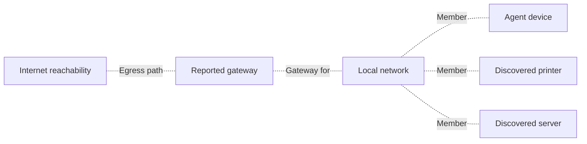

# Intelligent network topology — feasibility and build proposal

Date: 2026-09-15
Status: Historical feasibility assessment; superseded by the full engineering specification; no implementation or deployment performed
Source reviewed: checkout `a3be84980`

The authoritative specification is [Intelligent network topology](2026-09-15-intelligent-network-topology-design.md), with linked data/API, collection, and operations companions. Preserve this document as the investigation record; use the full specification for implementation decisions.

## Recommendation

Build on the existing Cytoscape canvas, discovery reconciler, UniFi integration, and monitoring command pipeline. Use measured network evidence to establish relationships, graph algorithms to arrange the diagram, and an optional LLM to explain evidence and guide troubleshooting.

Updated requirement: every site with known devices or configured networks gets a useful logical overview even when LLDP, CDP, SNMP, and controller discovery are unavailable. Physical discovery progressively adds detail; it is not a prerequisite for a connected overview. Missing gateway or egress evidence is shown explicitly, and never prevents rendering the known network.

The largest gaps are collection correctness, initial layout, and the connection between topology and monitoring. Adding an LLM alone would leave these gaps intact. Exact physical mapping remains limited by available switch/controller credentials and supported protocols; equipment behind unmanaged switches may remain unresolved.

This assessment is based on source inspection. The supplied production page could not be opened: no browser was available and the web reader rejected the URL. No production graph, credentials, scans, or monitoring results were accessed. No topology screenshot fixtures were found. A local headless Cytoscape reproduction could not run because this worktree lacks the dependency installation. The findings below are source findings, not claims about a reproduced production incident.

There is also a route/version discrepancy to resolve before implementation: `apps/web/src/components/devices/networkDevice/types.ts:35` only recognizes `overview` and `monitoring`; this checkout has no device-detail `topology` tab. The existing topology canvas is hosted by `DiscoveryPage.tsx`. The device URL's `#topology` fragment therefore does not identify an implemented tab in this checkout. Verify deployment/source parity and add a device-centered entry point.

## What already exists

| Area | Implemented foundation | Remaining gap |
| --- | --- | --- |
| Discovery | SNMP LLDP/CDP neighbors and bridge forwarding tables; reconciliation into stored links | Collection and port identity defects; incomplete relationships |
| Diagram | Cytoscape, fCoSE, subnet groups, manual nodes/edges, saved coordinates, keyboard-accessible device list | Automatic first placement, graph-aware layout, useful grouping at scale |
| Evidence | Method, confidence, interface name, VLAN, last verification | Both endpoint interfaces, merged observations, parallel physical links, freshness states |
| UniFi | Device/client identity and client `uplinkDeviceId` collection | Feed attachments into topology; complete additional endpoint collection for port metrics |
| Monitoring | Scheduled and ad-hoc ICMP/TCP/HTTP/DNS checks, results, history, alerts | Bind checks and alerts to graph elements |
| SNMP metrics | Polling/storage primitives and interface counter aggregation | Stable interface bindings, useful history API, full link health |
| AI | Network changes, IP history, baselines, and monitor tools | Scoped topology/evidence queries and diagnostic orchestration |

The June topology redesign spec describes the earlier starting point. Its claim that no topology writer exists is superseded by the current `reconcileTopology.ts` implementation.

## Findings that affect the design

1. **New nodes receive no initial layout.** The component assigns coordinates only when a saved row exists, then uses `preset`. There is no initial placement pass for newly discovered nodes. `NetworkTopologyMap.tsx:954–1016`.
2. **Auto-arrange excludes connections and does not save its result.** It calls layout on a collection obtained from `cy.nodes()`, containing only never-placed nodes. The edge collection and placed anchors are absent from that layout input. All saved nodes are treated as fixed regardless of the saved `pinned` field. The operation neither persists generated coordinates nor offers a full reflow. `NetworkTopologyMap.tsx:1291–1305`. Cytoscape documents that collection layouts operate on the supplied subset: [layout API](https://js.cytoscape.org/#eles.layout).
3. **FDB collection depends on neighbor advertisements.** A device's MAC forwarding table is collected only after LLDP or CDP returns a neighbor. A switch with useful forwarding data but no advertised neighbor cannot contribute host attachments. `agent/internal/discovery/adjacency.go:211`.
4. **Empty and failed observations need distinct contracts.** The scanner drops adjacency blocks with zero neighbors, while reconciliation assumes successful empty observations are present to age out old links. Failed walks also become empty arrays. This can preserve disappeared links or mistake a partial collection failure for lost connectivity. `agent/internal/discovery/scanner.go:425–439`; `apps/api/src/jobs/reconcileTopology.ts:237–242`.
5. **Uplink filtering lacks consistent port identity.** LLDP's row key is emitted as `timeMark.localPortNum`, `LocalIfName` is not populated, and CDP ifIndex differs from the FDB bridge-port identifier. Reconciliation cannot reliably compare these identifier spaces. `adjacency.go:57–65,126`; `reconcileTopology.ts:144`.
6. **The current link key represents an observation, not a cable.** Uniqueness is based on device pair and method, with only one interface name. Parallel cables can collapse; reciprocal LLDP and CDP observations can render as separate links. `apps/api/src/db/schema/discovery.ts:323–347`.
7. **UniFi has useful parent relationships, but not all advertised metrics.** `ConnectedDeviceID` decodes `uplinkDeviceId`, while port, VLAN, SSID, signal, traffic, CPU, and PoE fields are currently unpopulated collector fields. Database columns alone do not establish metric availability. `agent/internal/unifi/client.go:17–98`; `apps/api/src/services/unifi/unifiTelemetryService.ts:199`.
8. **The map is not an operational monitoring view yet.** It fetches topology on mount; its edge inspector shows provenance rather than health or checks. API `observedAt` is not retained in the frontend link type. Manual nodes without status default to online. The read endpoint has permission-based site filtering but no requested-site filter or graph bounds. `NetworkTopologyMap.tsx:65,288,656,1536`; `apps/api/src/routes/discovery.ts:1743`.
9. **Port-history work is required.** The old SNMP history/per-OID endpoints return 410; the replacement exposes only recent metrics. No built-in traceroute command was found. `apps/api/src/routes/snmp.ts:592–599`.

## Proposed behavior

### Baseline topology without managed-network discovery

The default is a logical connectivity overview. For a typical network, show devices attached to a local-network segment, its known gateway, and an Internet reachability node. The segment represents shared network membership and unknown intervening equipment, not a fabricated physical switch. Membership edges never claim a direct cable or a specific switch port.

This is an illustrative logical projection, not evidence about a particular deployed network. In the canonical model, `network_member` links endpoints to their network, `default_route` belongs to its reporting endpoint/interface, and `egress_path` belongs to its tested origin/context and destination. The drawing does not assign every network member the same gateway or demonstrate an observed gateway-to-Internet cable.

Collect routes, interface prefixes, gateway/next-hop identities, and DNS settings from the endpoint operating system. This does not require switch management protocols. Windows exposes the selected route and next hop through [Find-NetRoute](https://learn.microsoft.com/en-us/powershell/module/nettcpip/find-netroute?view=windowsserver2025-ps), and NetworkManager exposes gateway and route information through [IP4Config](https://networkmanager.dev/docs/api/latest/gdbus-org.freedesktop.NetworkManager.IP4Config.html). Implement supported Windows, macOS, and Linux collectors with explicit unsupported/failed outcomes and IPv4/IPv6 coverage.

Current Breeze payload/schema support is only partial: `agent/internal/heartbeat/ip_tracking.go:22` defines gateway, mask, and DNS fields, and `apps/api/src/routes/agents/schemas.ts:96` accepts them. However, `collectIPHistory` at `ip_tracking.go:348` currently populates interface, address, address family, assignment type, and MAC only. Extend collection rather than assuming stored fields contain observations. Represent multiple routes separately; one gateway field per IP is insufficient for VPNs, multiple interfaces, and multiple egress paths.

Baseline rules:

- Use the agent's route table to identify its configured gateway. Do not guess `.1` or `.254`. This evidence establishes routing intent, even if the gateway ignores probes.
- Associate the route with its reporting device and interface. Group peers under the applicable site/network segment, but do not assume every peer uses the same gateway merely because it shares a subnet.
- Prefer observed interface prefixes; label discovery-profile grouping as inferred when actual interface membership is unavailable. Scope network identities by organization, site, and routing context so reused private address ranges do not merge networks.
- Represent an observed but undiscovered gateway as a gateway role. A gateway may be a virtual address or service, not one known physical router. Bind discovered inventory to that role only when identity is supported; retain positions and evidence without merging distinct HA members into one device.
- Show an Internet node as a diagnostic destination, with reachable, degraded, unknown, or failed-check status and the reporting agent/time. Show the local gateway-to-egress relationship only to the extent supported by route selection and probes. Outbound access could use a VPN, proxy, cellular interface, or another gateway.
- If no route evidence exists, display "Gateway not identified" as a presentation placeholder. Its objects use the `presentation:` namespace and its edges have `meaning:'schematic'`, `presentationOnly:true`, and `relationshipKind:null`; there is no `placeholder` canonical relationship enum or diagnostic authority. If the endpoint reports no default route, show that state explicitly. A site with no agent can still show inventory/network groups and schematic objects, but cannot claim current gateway or internet measurements.
- Separate relationship kind (`network_member`, `default_route`, `egress_path`, `attachment`, `physical_link`) from provenance (`observed`, `inferred`, `manual`), confidence, freshness, and health. A route read from the OS is an observed logical relationship, not an uncertain physical cable. Use line patterns and readable labels; reserve health colors for check results.
- As physical discovery arrives, expand network groups with measured switches, APs, and ports. Preserve the logical overview and avoid duplicate attachment lines or layout jumps. Unresolved devices stay usefully grouped.

Useful baseline diagnostics require no LLDP: explicitly probe a route-reported gateway from its eligible same-site agent, then test DNS and HTTP/TLS only against configured diagnostic targets. With no known-answer DNS name or external destinations configured, the respective recipe reports `target_not_configured` and sends zero external probes; opening the map sends none either. The current [baseline-no-management acceptance scenario](2026-09-15-intelligent-network-topology-design.md#12-acceptance-matrix-and-verification) separately seeds a known-answer DNS target and two controlled HTTPS destinations using mocked transport to verify outbound diagnostics. Scope all results to the probe origin and selected route. Distinguish DNS failure from broader outbound failure; an ICMP timeout alone does not prove a gateway is down. Loss of an agent connection makes its measurements stale, not proof that the site's internet is down. Record probe method, timing, failure details, and last successful evidence.

The revised specification proposes reusable partner-or-organization templates, immutable versions, and explicit site bindings as specified in [Data](2026-09-15-intelligent-network-topology-data-contracts.md#partner-and-organization-template-library). The effective configuration follows code defaults, selected partner version, selected organization version, then site overrides. An authorized bulk preview/apply can adopt pinned versions across 200 sites in one action; template publication or reading never enables active probes or schedules. Execution and recurring-policy re-arm retain existing permission/MFA requirements.

The product promise is an automatically connected, explicitly labeled logical overview for every known network, progressively enriched with physical detail. Isolated, offline, and unobserved networks remain useful diagrams with truthful unknown states. No LLM is required for this baseline.

### Automatic connections

Treat each relationship as evidence with a source, timestamp, endpoints, collection outcome, and confidence. Maintain a canonical relationship derived from these observations.

- LLDP/CDP establishes infrastructure adjacency after correct local/remote port resolution.
- UniFi client uplink identity establishes controller-reported client-to-switch/AP attachment where identities match within the same organization and site. A missing port stays unknown.
- FDB supports host attachment after excluding known uplinks and ambiguous multi-MAC ports. Preserve uncertainty about intervening unmanaged equipment.
- Routing tables and gateway information power the baseline logical overview in the first release. ARP/neighbor tables can corroborate identities; shared subnet membership creates a membership relationship, never a physical cable.
- Reconcile reciprocal observations into one relationship while preserving distinct port pairs and link-aggregation members.
- Keep manual assertions and proposed relationships distinct from measured evidence. Discovery does not erase manual work.
- Track each protocol as successful, unsupported, failed, or not attempted. A failed poll makes evidence stale; it does not by itself prove that a link disappeared.
- Show useful coverage explanations: credentials needed, protocol unsupported, collection failed, or attachment unresolved.

### Automatic placement and better appearance

Keep Cytoscape. First fix its existing layout path; evaluate ELK Layered for the default infrastructure diagram. [ELK supports layered placement, orthogonal routing, explicit ports, and multiple edges](https://eclipse.dev/elk/reference/algorithms/org-eclipse-elk-layered.html). Its routed bend points would need to be carried through to the canvas renderer. Existing [fCoSE constraints](https://github.com/iVis-at-Bilkent/cytoscape.js-fcose) provide another option for fixed positions and relative placement.

The default scene starts with the baseline logical overview and adds observed gateways/firewalls, the switch backbone, APs, and collapsed endpoint groups as evidence permits. Layout order is a presentation choice, not evidence of routing or traffic direction. Preserve cycles, redundant uplinks, and parallel connections.

- Start with the selected device's site and highlight that device plus its immediate neighbors; expand to the complete site on demand.
- Place new devices automatically near their observed parent, with measured label bounds and collision avoidance.
- Preserve explicitly pinned positions. Distinguish saved automatic coordinates from user pins.
- Separate disconnected components and offer an unresolved-devices area without drawing invented edges.
- Collapse endpoint groups into counts; expand a switch/AP to inspect clients. Offer physical, logical/VLAN, and health views when their data exists.
- Use restrained device tiles with readable name/type/status. Use line pattern and evidence labels for provenance; reserve red/amber for operational problems. Unknown and stale remain explicit states.
- Put search, site selection, Fit, Arrange, and view controls in a compact toolbar. Move detailed evidence, charts, and checks into a persistent inspector.
- Provide “Arrange new devices” and “Reflow unpinned devices,” undo, and batch coordinate persistence. Read-only users can arrange a local view without writing shared coordinates.
- Incrementally update health without recreating the graph or losing selection, pan, zoom, or layout. Use progressive loading/expansion for large sites.
- Preserve the accessible device list and extend it to selectable connections and diagnostics. Store selected site/device/view state in the URL hash.

### Functional nodes and connections

| Selection | First useful release | Later telemetry work |
| --- | --- | --- |
| Device | Reachability, current alerts, recent check results, Run check, open device details | Interface inventory and device-specific diagnostic bundles |
| Connection | Both known endpoints/ports, evidence, confidence, age, relevant endpoint monitors | Operational state, speed, utilization, errors/discards, flap history, PoE where supported |
| Path | Highlight observed relationships and their evidence | Same-site agent probes, traceroute, observed routed paths, probable fault localization |
| Incident | Show associated alerts and potentially affected devices | Topology-aware correlation that accounts for redundancy and uncertain/stale links |

Reuse existing monitor results immediately. Before exposing manual Run check, resolve the separate [monitor executor bug #5987](https://github.com/LanternOps/breeze/issues/5987): the route's on-demand selector can fall back across sites and omits the ephemeral-agent exclusion already enforced by the scheduled worker. Add typed, bounded diagnostic actions using the established command pipeline and an authorized agent in the correct site. Display the probe origin, destination, method, and timestamp. Some existing ping handling can fall back to TCP; report the actual method used.

An agent-to-target ping measures that path, not an individual physical connection. Port counters measure the corresponding interface and can include other traffic. A highlighted graph route does not prove the network's forwarding path. Keep these meanings distinct in copy and data contracts.

For real link metrics, add stable endpoint/interface identities, high-capacity counters, reset/wrap-aware rate calculation, speed units, freshness, and a scoped history API. Complete UniFi detail/statistics collection before advertising live traffic or PoE overlays. Correlate probable upstream incidents conservatively; uncertain graph connections must not silently suppress alerts.

### AI assistance

Add read tools such as `get_topology`, `get_link_evidence`, `get_link_health`, and `get_recent_network_changes`, then a bounded `diagnose_connectivity` workflow over existing authorized checks.

Useful questions include “Why is this device disconnected?”, “Which devices may be affected by this switch?”, “What changed before this outage?”, and “What should I check next?” Answers should cite observations and diagnostic results, identify missing data, and distinguish possible causes from confirmed findings.

Use an LLM to interpret ambiguous labels, rank competing attachment hypotheses, recommend the next probe, and summarize results. Proposed connections remain explicitly proposed until corroborated or accepted as a manual assertion. Coordinates and verified links remain algorithmic. Cache analysis by graph/evidence revision rather than calling a model for every refresh or device pair. Send only the scoped evidence needed, excluding credentials and unnecessary raw configuration.

## Delivery order and acceptance criteria

1. **Useful map on every network:** collect endpoint routes, prefixes, gateway, and DNS settings; produce the baseline logical overview without LLDP/SNMP; include gateway/DNS/outbound check results where available. Repair initial placement and edge-aware layout; honor pins; save arranged positions; add site/device focus, unresolved groups, and freshness. Cover no management protocols, no default route, no agent, gateway blocking ICMP, VPN/multiple gateways, IPv6, reused subnets across sites, stale data, and placeholder-to-discovered identity reconciliation. Also cover fresh maps, partially placed maps, all-pinned maps, disconnected components, cycles, long labels, and reload stability with real layout-engine checks in addition to UI mocks.
2. **Trustworthy automatic connections:** fix collection outcome semantics and port identity; collect FDB independently; materialize supported UniFi attachments; canonicalize evidence and parallel links. Test successful-empty versus failed collection, missing credentials, uplink exclusion, conflicting identities, aging, and manual preservation. This must land before topology drives diagnosis.
3. **Operational map:** connect existing monitors/alerts and on-demand checks; add interface inventory/history and telemetry bindings; then introduce link metrics and path diagnostics. Verify collector/site selection, permission denial, timeout/failure feedback, and unknown/stale behavior.
4. **Assisted investigation:** expose scoped graph/evidence tools, evidence-backed summaries, and topology-aware incident correlation. Test unsupported conclusions, conflicting evidence, redundant paths, and isolation across organizations/sites.

All new tenant tables require enabled/forced RLS and policies in the creating migration. RLS protects organization access; existing application-layer site allowlist/access helpers enforce site authorization on every path. Validate endpoint/metric/collector ownership server-side. Use `runAction` for web mutations. Run the RLS contract/integration tests for schema changes, Go tests with `-race` for collector changes, and focused API/web tests plus browser checks for the implemented slices.

The first release can deliver a visibly better, automatically arranged map and actionable device checks without any LLM dependency. Reliable port-level monitoring and AI-assisted investigation then build on the same evidence model.
